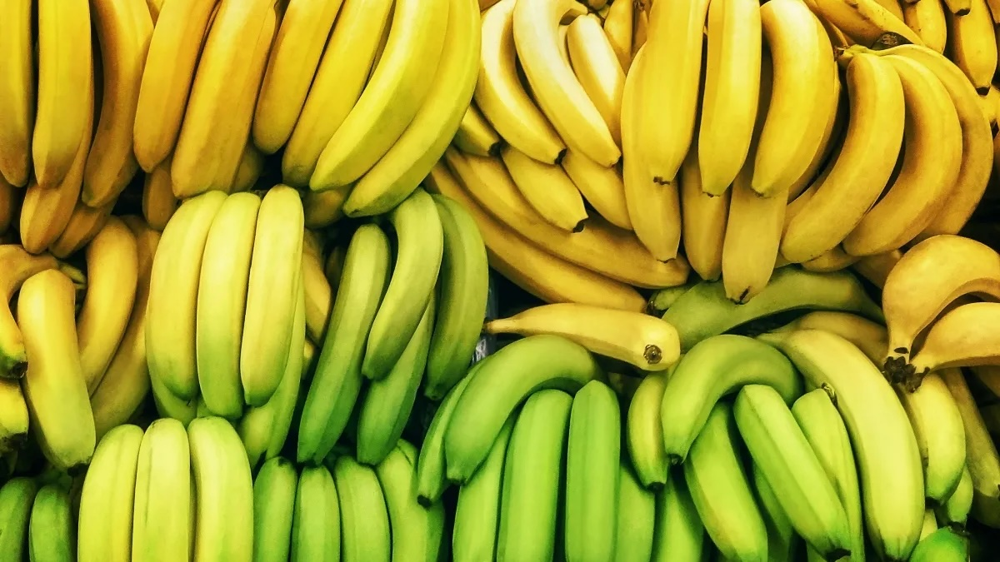

# Laporan Proyek Machine Learning - Lusi Aulia Jati

## Domain Proyek
Buah pisang ketika dipanen memperhatikan ukuran, umur buah, dan hal lainnya. Kemudian setelah dipanen dapat diklasifikasikan apakah buah pisang yang dipanen berkualitas baik atau tidak. Jika buah tidak berkualitas baik, tentu akan merugikan. Sehingga pada penelitian kali ini akan dicoba analisis bagaimana faktor kematangan, umur panen, tingkat kemanisan, keasaman buah, ukuran buah, berat buah, dan softness berpengaruh terhadap kualitas buah. 

## Business Understanding
### Problem Statements
Bagaimana faktor kematangan, umur panen, tingkat kemanisan, keasaman buah, ukuran buah, berat buah, dan softness berpengaruh terhadap kualitas buah ? 
### Goals
Mengetahui bagaimana faktor kematangan, umur panen, tingkat kemanisan, keasaman buah, ukuran buah, berat buah, dan softness berpengaruh terhadap kualitas buah. Akan digunakan metode machine learning klasifikasi dengan model K-Nearest Neighbor (KNN), Logistic Regression, dan XGBoost. 

## Data Understanding
Data yang digunakan yaitu data karakteristik buah pisang yang dipanen dengan total berisi 8000 data. Karakterisitik buah yang dimaksud adalah ukuran, berat, tingkat kemanisan, tekstur softness, waktu panen, kematangan, keasaman dan kualitas buah. Data bersumber dari [Kaggle Banana Quality Dataset](https://www.kaggle.com/datasets/l3llff/banana).

## Data Preparation
Tahapan pengolahan data yang dilakukan meliputi proses EDA (exploratory data analysis)dan  data preparation yang meliputi pengecekan data kosong, penanganan outlier, korelasi, statistik deskriptif, penyamaan skala data menggunakan minmax scaler, pembagian data menjadi data training dan test.

## Modeling
Digunakan model K-Nearest Neighbor (KNN), Logistic Regression, dan XGBoost untuk mengklasifikasikan data sehingga diperoleh prediksi kualitas buah pisang yang dipanen baik atau tidak. 

## Evaluation
Menggunakan metrik accuracy untuk mengevaluasi model, diperoleh hasil bahwa model K-Nearest Neighbor dan XGBoost memiliki performance yang sangat baik yaitu 97% Mengindikasikan bahwa model sudah bisa mengklasifikasikan data karakteristik buah pisang apakah berkualitas baik atau tidak dengan baik. Namun untuk penelitian selanjutnya akan lebih baik jika digunakan evaluasi lainnya seperti precision, recall, F1-score, atau AUC-ROC dan pengecekan apakah model overfit atau tidak supaya jika digunakan data baru model dapat memprediksi dengan baik.
